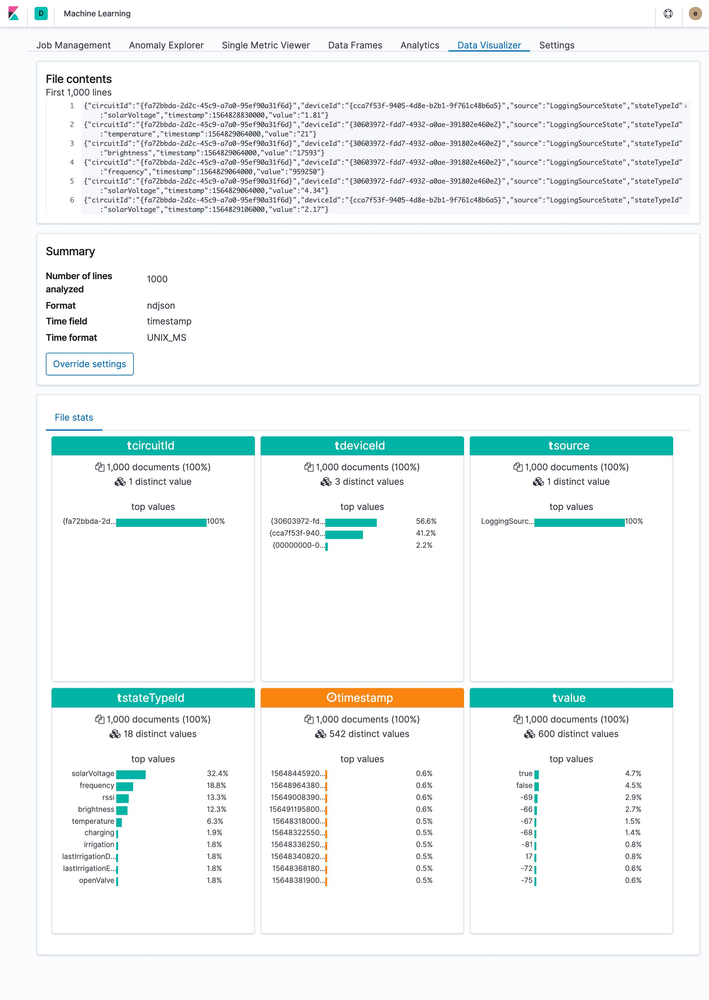
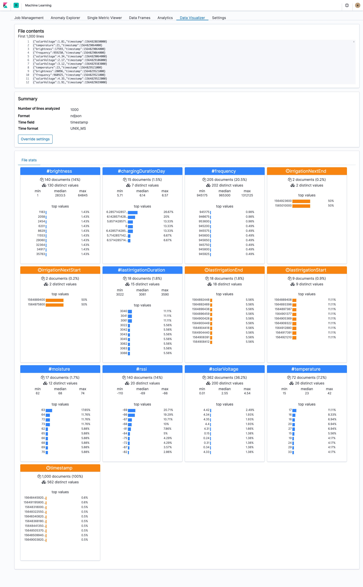
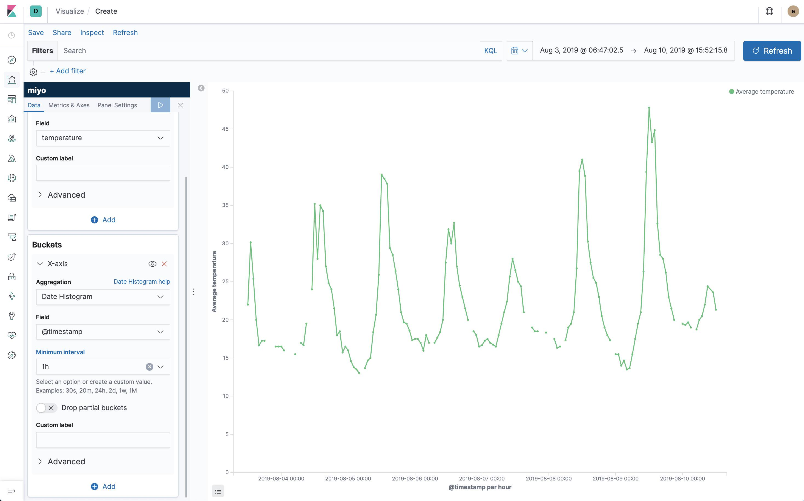
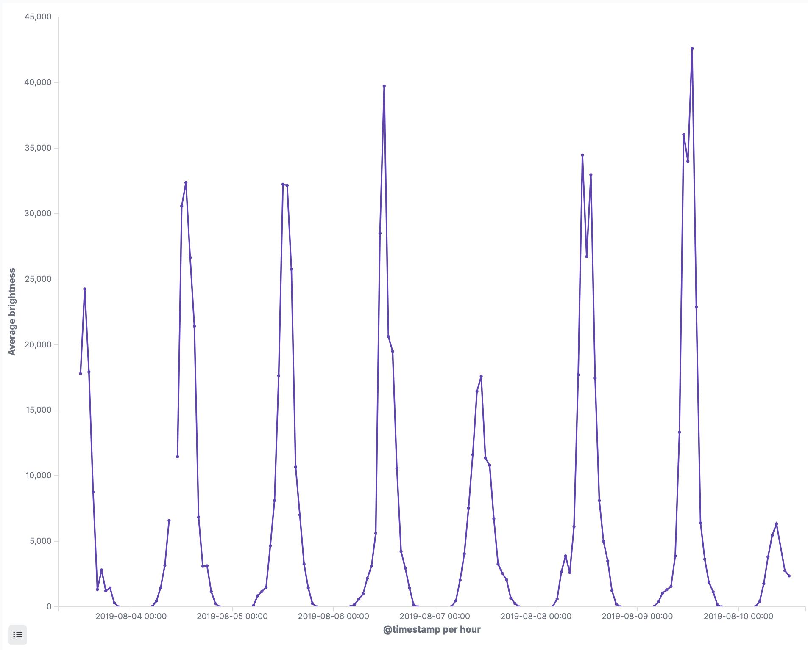
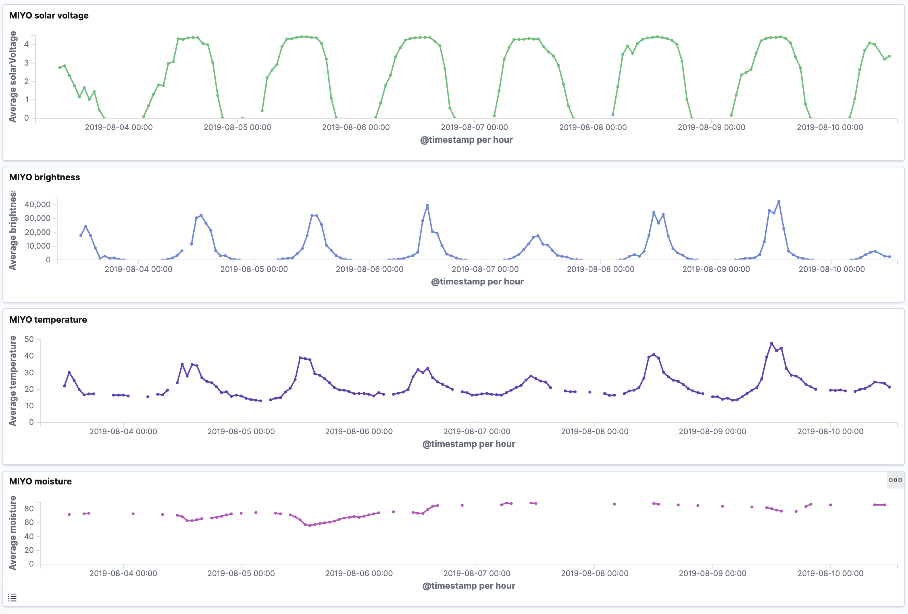
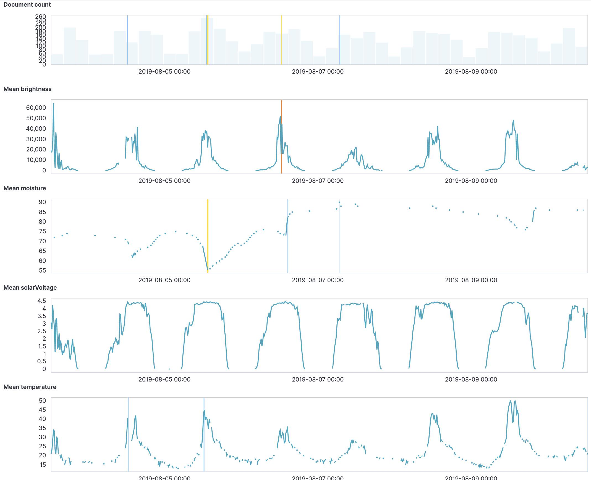
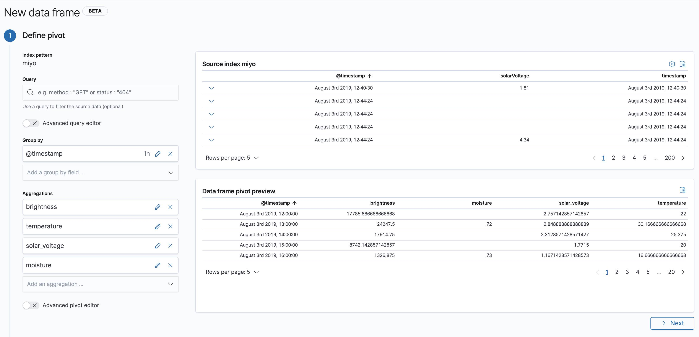
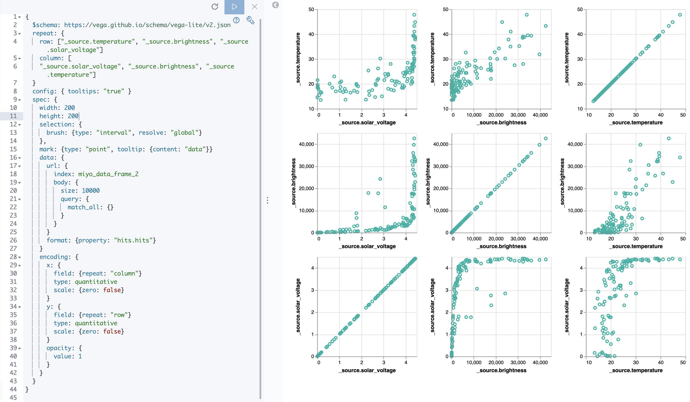
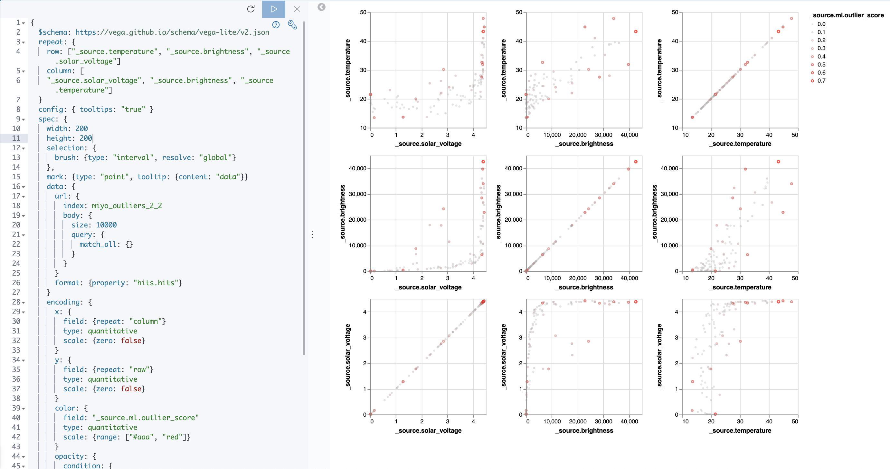

# miyo2elasticsearch

This documents some basic data exploration techniques. The idea is to take some data we don't know that much about yet and try to find out what we can learn about it.

For this experiment we're using data from [Viratec's MIYO smart garden system](https://www.miyo.garden/en/). The whole setup consists of a garden sensor, valve and cube (the coordinator). Everything is stored locally on the cube and can be [accessed via REST](https://docs.google.com/document/d/1K3MOLDid8f9C-blYbd6N0WpCls5QpK_Wm0yAmLYJbzY/export?format=pdf).

First step is to get access to the cube. That means we need to briefly (yes, physically) push the pairing button on the actual MIYO cube. Once this is done, the endpoint to get an API key (`http://<miyo-ip>/api/link`) is enabled. The API key we got can now be used with other request which require authentication. Note that the API key includes curly braces, don't forget to add them for requests!

Using their REST logging endpoint (`http://<miyo-ip>/api/logging/entries?apiKey={xxx}`) you'll get a JSON response with all kinds of events:

```json
{
  "id": 0,
  "params": {
      "history": [
          {
              "circuitId": "{fa72bbda-2d2c-45c9-a7a0-95ef90a31f6d}",
              "deviceId": "{cca7f53f-9405-4d8e-b2b1-9f761c48b6a5}",
              "source": "LoggingSourceState",
              "stateTypeId": "solarVoltage",
              "timestamp": 1564828830000,
              "value": "1.81"
          },
          {
              "circuitId": "{fa72bbda-2d2c-45c9-a7a0-95ef90a31f6d}",
              "deviceId": "{30603972-fdd7-4932-a0ae-391802e460e2}",
              "source": "LoggingSourceState",
              "stateTypeId": "temperature",
              "timestamp": 1564829064000,
              "value": "21"
          },
...
```

Here's a full example file: [logging_entries.json](logging_entries.json).

We want to learn more about the data and its attributes. We'll use [jq](https://stedolan.github.io/jq/) to transform the data so we can use it for further analysis. The following command reads the same data again from the API endpoint, then transforms the events into NDJSON:

```bash
curl -X GET -G "http://<miyo-ip>/api/logging/entries" -d "apiKey={xxx}" | jq -c .params.history[] > logging_entries_nd.json
```

`.params.history[]` will output all elements of the `history` array while the `-c` option will avoid "pretty-printing" the JSON so every element will end up as an individual JSON doc on each line. Here's a sample of the result (and here's the full file: [logging_entries_nd.json](logging_entries_nd.json)):

```json
{"circuitId":"{fa72bbda-2d2c-45c9-a7a0-95ef90a31f6d}","deviceId":"{cca7f53f-9405-4d8e-b2b1-9f761c48b6a5}","source":"LoggingSourceState","stateTypeId":"solarVoltage","timestamp":1564828830000,"value":"1.81"}
{"circuitId":"{fa72bbda-2d2c-45c9-a7a0-95ef90a31f6d}","deviceId":"{30603972-fdd7-4932-a0ae-391802e460e2}","source":"LoggingSourceState","stateTypeId":"temperature","timestamp":1564829064000,"value":"21"}
{"circuitId":"{fa72bbda-2d2c-45c9-a7a0-95ef90a31f6d}","deviceId":"{30603972-fdd7-4932-a0ae-391802e460e2}","source":"LoggingSourceState","stateTypeId":"brightness","timestamp":1564829064000,"value":"17593"}
{"circuitId":"{fa72bbda-2d2c-45c9-a7a0-95ef90a31f6d}","deviceId":"{30603972-fdd7-4932-a0ae-391802e460e2}","source":"LoggingSourceState","stateTypeId":"frequency","timestamp":1564829064000,"value":"959250"}
...
```

Since Kibana v6.5 you can just drop such files into its file visualizer. It's a great way to quickly explore the data:



This surfaces a problem in the data structure, at least if we want to move on with this in Elasticsearch. The value field uses mixed types (boolean/numeric/timestamp) across different documents.

Let's transform the data again using `jq`: 

```bash
curl -X GET -G "http://<miyo-ip>/api/logging/entries" -d "apiKey={xxx}" | jq -c .params.history[] | jq -c '{(.stateTypeId): .value|tonumber, timestamp}' > logging_entries_transform_nd.json
```

Again, we're outputting each element of the `history` array but this time we're piping it again through `jq`. `'{(.stateTypeId): .value|tonumber, timestamp}'` will create an object where `stateTypeId` will be used as the attribute `key` with `value` as it's value converted to a number. Note that this will skip the elements the have a `boolean` as value, we'll skip those for now. Here's the result ([logging_entries_transform_nd.json](logging_entries_transform_nd.json)):

```json
{"solarVoltage":1.81,"timestamp":1564828830000}
{"temperature":21,"timestamp":1564829064000}
{"brightness":17593,"timestamp":1564829064000}
{"frequency":959250,"timestamp":1564829064000}
...
```

Back in Kibana file visualizer with the transformed file, we now have distinct fields for each metric:



Let's create an Elasticsearch index and Kibana index pattern named `miyo` based on this. Note how Kibana's file visualizer is able to infer types from the different fields:

```json
{
  "@timestamp": {
    "type": "date"
  },
  "brightness": {
    "type": "long"
  },
  "chargingDurationDay": {
    "type": "double"
  },
  "frequency": {
    "type": "long"
  },
  "irrigationNextEnd": {
    "type": "date",
    "format": "epoch_second"
  },
  "irrigationNextStart": {
    "type": "date",
    "format": "epoch_second"
  },
  "lastIrrigationDuration": {
    "type": "long"
  },
  "lastIrrigationEnd": {
    "type": "date",
    "format": "epoch_second"
  },
  "lastIrrigationStart": {
    "type": "date",
    "format": "epoch_second"
  },
  "moisture": {
    "type": "long"
  },
  "rssi": {
    "type": "long"
  },
  "solarVoltage": {
    "type": "double"
  },
  "temperature": {
    "type": "long"
  },
  "timestamp": {
    "type": "date",
    "format": "epoch_millis"
  }
}
```

Now with the data in Elasticsearch, we can create a first visualization: Temperature over time. We note we got about a week of data. There's also some gaps.



And here's the brightness metric:



Adding all metrics to a Kibana Dashboard we're starting to see some correlations:



Using Elasticsearch's anomaly detection ([anomaly_detection.json](anomaly_detection.json)):



To run further analysis on the data, again, we need to do some data transformation to create feature vectors. The current data shape has only one attribute in each document. Since v7.2 Elasticsearch has a data frame transform feature to pivot data ([data_frame.json](data_frame.json)):



Now that we have the data grouped by hour and each document includes all data dimensions, let's do a scatterplot matrix to visualize attribute correlations. I'm using Kibana's Vega plugin here:



Since v7.3 Elasticsearch's machine learning features outlier detection. Run the following commands in Kibana's Dev Console to create and start the outlier detection analytics job (assuming you created a data frame with the configuration provided further above with the `miyo_data_frame` destination index):

```json
PUT _ml/data_frame/analytics/miyo_outliers
{
  "source": {
    "index": "miyo_data_frame"
  },
  "dest": {
    "index": "miyo_outliers"
  },
  "analysis": {
    "outlier_detection": {}
  },
  "analyzed_fields" : {
    "includes" : ["brightness", "temperature", "solar_voltage", "moisture"]
  }
}

POST _ml/data_frame/analytics/miyo_outliers/_start
```

Based on the above, here's another Vega scatterplot matrix, but this time with the outlier scores encoded as the data points' color (Vega spec: [kibana_vega_scatterplot_matrix.json](kibana_vega_scatterplot_matrix.json)):



Looking at the charts, we get some trivial insights, like the positive linear correlation between brightness and temperature. Since this is weather data, we know the domain and the result may seem obvious. But keep in mind we're not at the stage of getting some advanced insights. We're still at the stage of basic data exploration and experimentation, to simply learn about the quality of the data and to evaluate at a very basic level what we're dealing with.

Note we didn't use any programming to get to this stage. Use what works best for you to get results quickly. For example, all of this could be done in a Jupyter notebook of course. Depending on what you're after, there's no need to do everything in one tool or framework.
